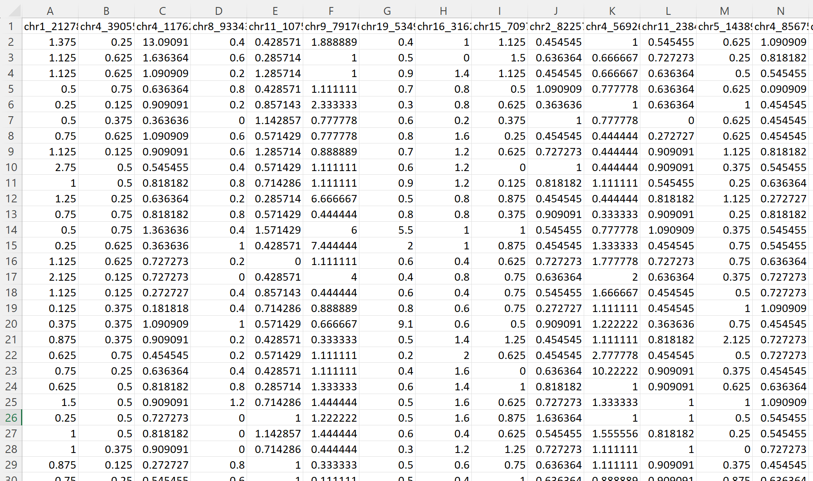

# 4761_project


This is the GitHub repo for 4761 final project by

Dependencies:
```
- python 3.9
- anaconda
- jupyternotebook
- samtools 
- bedtools 
- wget 
- matplotlib 
- numpy
- seaborn 
- scipy
- pandas
- numpy
- sklearn
```


- Step 1. data downloading from ENCODE for cell lines described in cell_lines.txt. We download data from https://www.encodeproject.org/matrix/?type=Experiment&control_type!=*&status=released&perturbed=false. We create dictionary for each cell line. Then, we download data through bash script using wget in Linux server. The download.sh is an example script that we use to download cell line A549 bam files. We run the script as 

```
sh download.sh
```

- Step 2. Reference hg38 bed genertaion
We downloaded hg38.fa as our reference genome and create a reference bin file using following commands:

```
# bin the chromosome based on reference 
# use -w to indicate the bin width

samtools dict hg38.fa > hg38.fa.dict
cat hg38.fa.dict|grep -v '^@HD'|sed 's/:/\t/g'|cut -f 3,5 >genome.chr.ln
bedtools makewindows -g genome.chr.ln -w 1000 > 1000.genome.bed
```


- Step 3. Data binirization

Bed and BigWig files were downloaded from ENCODE as described earlier. Firstly, we use bash script to transfrom all BigWig format into bed format using bigwig_to_bed.sh. 
 
```
cd woring_directory/ 
sh bigwig_to_bed.sh
```

An example working directory will look like this:


Then, we process all bed files to binary bin with another bash script all_bash_to_bin.sh. The all_bash_to_bin.sh have dependencis on bed_to.bin.sh and 1000.genome.bed.

```
cd woring_directory/ 
sh all_bed_to_bin.sh
```


- Step 4. Data aggregation

We use bash script move_ctcf.sh, move_DNase.sh, move_histone.sh, move_datarna_total.sh to moved respected seqencing data together and use combined.sh to merge them together as a single file. The script require the input of cell_lines_header file


```
cd woring_directory/data_type/
sh combined.sh
```

We will obtain data in format like this: 


At this step, we also generate figure 1 & 2 using pandas Dataframe and matplotlib by selecting row with a sum of zero, and count empty bin for each columns.

- Step 5. Bam files process 

After trying binirized data, we decide to process bam to bin.We use bash script all_bamtobed.sh with a dependencies in 1000.genome.sorted.filter.bed and bamtobed.sh.  


```
cd woring_directory/
nohup sh all_bamtobed.sh & #this step will take hours, we need to run it in background without interuption.
```

- Step 6. bam_based bin files to merged files
repeat step 4  

- Step 7. Input matrix and output matrix generation

We use a python script data_formatting.py to perfrom log normalization, random bin selections, and data formatting. 


```
# run the script and set working direcotry first
python data_formatting.py

ctcf_df, h3k9me3_df, dnase_df, rna_df = read_df("ctcf.bin","h3k9me3.bin","dnase.bin","rna.bin")
    
sample_split(ctcf_df, h3k9me3_df, dnase_df, rna_df)
    

ctcf_df = pd.read_csv('outsample_ctcf.bin')
h3k9me3_df = pd.read_csv("outsample_h3k9me3.bin")
dnase_df = pd.read_csv("outsample_DNase.bin")
rna_df = pd.read_csv("outsample_rna.bin")
 
out_sample_process(ctcf_df, h3k9me3_df, dnase_df, rna_df, 10000, interval = 500000) 
    
ctcf_df = pd.read_csv('insample_ctcf.bin')
h3k9me3_df = pd.read_csv("insample_h3k9me3.bin")
dnase_df = pd.read_csv("insample_DNase.bin")
rna_df = pd.read_csv("insample_rna.bin")
random_sample_generation(ctcf_df, h3k9me3_df, dnase_df, rna_df, samples_size, interval = 500000)

```

Perform this process for both binarized data and unbinarized data.We will have input files in format that columns name are the bins infromation and row is the bin read within 500kb form the DNase bin. 





For output data, we will have files in format that columns name are the bins infromation and row is the DNase bin count for this bin. 


- Step 9 Model training

We train model on these data and assay thier performance. All the infromation about this step is include in Model_10000.ipynb. 


